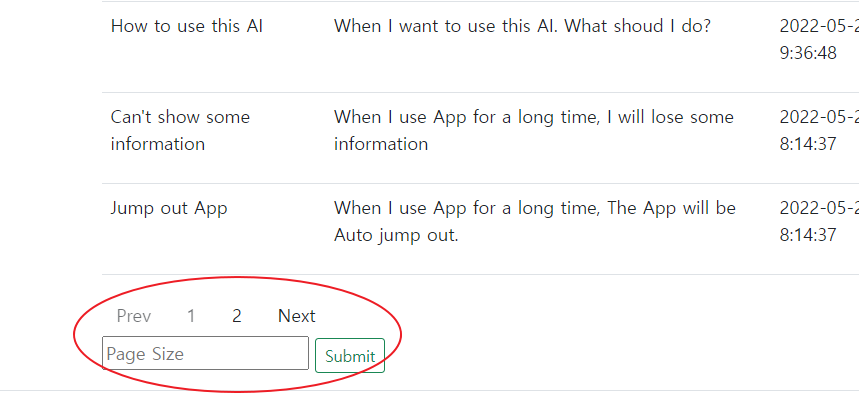
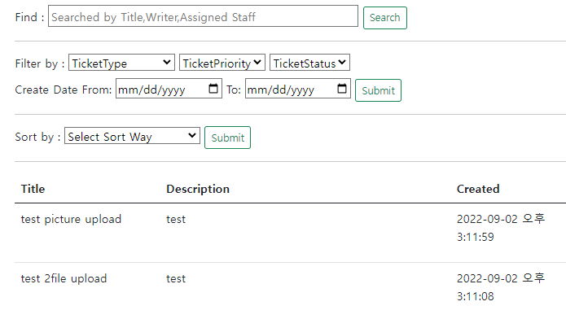
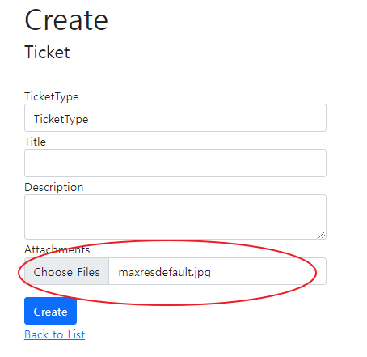
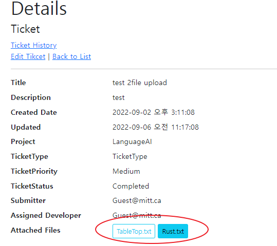
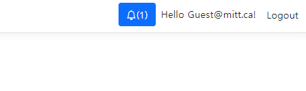
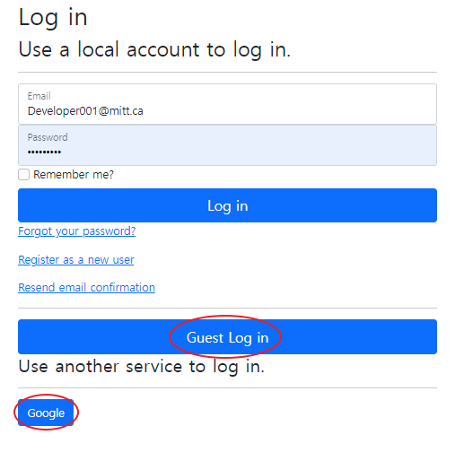
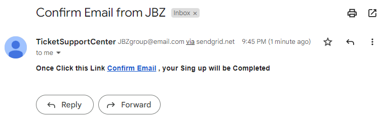

# FinalProjectOfUnittest( Ticket(Request) system

## this proeject is making Ticket(request) system.

## Applied Features

## 1. Paging(user can change page size). 

## 2. Searching,Filtering and sorting ticekts 

## 3. Upload files to SQL server While Creating Ticket 

## 4. Download files from SQL server in Detail page of Ticket 

## 5. Notice( A.When developer is assigned, devpeloper get notice. B.when ticket completed, project manager get notice )

## 6.Guest Login and Google Login - Guest can have all roles of this web

## 7. Implement Data Access Layer, Business Logic Layer and Unit test

## 8. Implement Confirm Email Process(Register or Recover Password)

